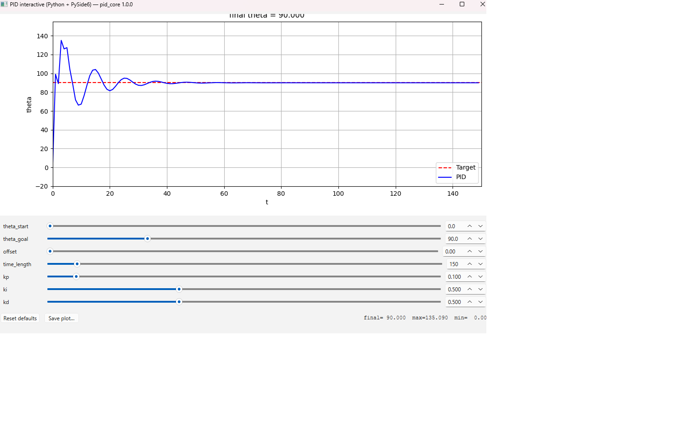

# Interactive PID demo — multi-frontend port

A C++ implementation of the discrete PID controller from
`pid_advanced_simulation.py`, plus three GUI frontends sharing the
same core.

```
┌──────────────────────────────────────────────────────────────────────┐
│             C++ core  (libpid_core.so / .dll / .dylib)               │
│             ─ Discrete PID:                                          │
│               m         = kp·e + ki·Σe + kd·Δe                       │
│               theta    += m                                          │
│               theta    -= offset                                     │
│                                                                      │
│   ┌─────────────────┐  ┌─────────────────┐  ┌──────────────────────┐ │
│   │ Qt6 / C++       │  │ Avalonia / C#   │  │ PySide6 / matplotlib │ │
│   │ frontend_qt     │  │ frontend_avalonia│ │ frontend_python      │ │
│   └─────────────────┘  └─────────────────┘  └──────────────────────┘ │
└──────────────────────────────────────────────────────────────────────┘
```

All three frontends provide a slider-driven interactive UI: drag the
PID gains, the start / goal angles, the offset, or the simulation
length and watch the response plot update live.



This repository is the **minimal "one core, three GUIs" template** of the
family — it focuses on the cross-language wiring (a stable C ABI driven from
Qt6 / Avalonia / Python). For a deeper numerical treatment of PID
*discretisation schemes* (forward/backward Euler, Tustin, …) see the sibling
project **pid-discretization-lab**.

> **Gains.** The default config is gentle (`kp=0.10, ki=0.01, kd=0`, a
> well-damped rise to the goal). The Python reference / the screenshot above
> use the more aggressive `kp=0.10, ki=0.5, kd=0.5`, which overshoots to
> ~135° before settling to 90°.

---

## Directory layout

```
pid/
├── core/                            # cross-language C++ library
│   ├── include/pid_core.h           #   public C ABI
│   ├── src/pid_core.cpp             #   simulator + ABI
│   ├── tools/smoke_test.cpp         #   regression test (ctest)
│   └── CMakeLists.txt
├── frontend_python/                 # Python frontend
│   ├── pid_core.py                  #   ctypes bindings
│   ├── app_matplotlib.py            #   drop-in for the reference script
│   ├── app_pyside6.py               #   GUI
│   └── requirements.txt
├── frontend_qt/                     # Qt6 (C++) frontend (reference look)
│   ├── main.cpp, MainWindow.{hpp,cpp}, Widgets.{hpp,cpp}
│   └── CMakeLists.txt
├── frontend_avalonia/PidAvalonia/   # Avalonia (C# / .NET 8) frontend
│   ├── PidAvalonia.csproj
│   ├── Native/{PidCoreNative.cs, PidSolver.cs}
│   ├── Models/GridLineMarker.cs
│   ├── ViewModels/MainWindowViewModel.cs
│   ├── Views/MainWindow.{axaml,axaml.cs}
│   ├── App.axaml{,.cs}, Program.cs, app.manifest
├── build_all.sh
├── LICENSE
└── README.md
```

---

## 1. Building the core library

Requirements: CMake 3.16+, a C++17 compiler. **No external deps** —
this is a pure-C++ simulator with no Eigen / scipy / control needed.

```bash
cd core
mkdir build && cd build
cmake .. -DCMAKE_BUILD_TYPE=Release
cmake --build . -j
```

Regression test (registered with CTest):

```bash
cmake -S core -B core/build -DCMAKE_BUILD_TYPE=Release
cmake --build core/build
ctest --test-dir core/build --output-on-failure
```

The test pins the Python-reference response for `kp=0.1, ki=0.5, kd=0.5`
(`theta = 0, 99, 89.1, 135.09, 125.991, …`, max `135.09`, settles to `90`),
checks the default config converges, verifies the output clamp caps each
step, and that invalid configs (NULL, `time_length < 2`, `dt <= 0`,
non-finite gains) return NULL.

---

## 2. Qt6 (C++) frontend

Requirements: Qt 6.2+, CMake 3.16+, a C++17 compiler.

```bash
cd frontend_qt
mkdir build && cd build
cmake .. -DCMAKE_BUILD_TYPE=Release
cmake --build . -j
./pid_qt
```

The Qt CMake config pulls in the sibling `../core` automatically.

This is the "reference look" — the Avalonia frontend matches its
layout deliberately.

---

## 3. Avalonia (C#) frontend

Requirements: .NET 8.0 SDK and internet for the initial NuGet restore.

```bash
# 1) build the core first
cd core && mkdir -p build && cd build
cmake .. -DCMAKE_BUILD_TYPE=Release && cmake --build . -j
cd ../..

# 2) build + run the Avalonia frontend
cd frontend_avalonia/PidAvalonia
dotnet run -c Release
```

The csproj copies `libpid_core.so` (or platform equivalent) into the
build output next to the executable.

---

## 4. Python frontend

Requirements: Python 3.10+, NumPy, matplotlib, PySide6.

```bash
# build the core first, then:
cd frontend_python
pip install -r requirements.txt

python3 app_matplotlib.py   # drop-in for the original reference script
python3 app_pyside6.py      # GUI
```

Both apps locate `libpid_core.so` automatically by looking in
`../core/build` (and a few other common places). Override with
`PID_CORE_LIB=/path/to/libpid_core.so`.

---

## Algorithm notes

The core reproduces the original Python `pid_control` and extends it with
three practical knobs (all reducing to the original when left at defaults):

- **`dt`** — sample period. The integral accumulates `error · dt` and the
  derivative is `(error − error_pre) / dt`. With `dt = 1.0` (default) this is
  exactly the original `Σ error` / `error − error_pre` behaviour.
- **`output_clamp`** — actuator saturation: `|m|` is capped per step
  (`0` = disabled).
- **`integral_clamp`** — anti-windup: `|Σ error|` is bounded (`0` = disabled).

After applying the control increment, an `offset` is subtracted from `theta`
each step (the script's model of a passive disturbance). The simulation
produces exactly `time_length` samples, with index 0 holding the initial
state `theta_start` and indices 1..N-1 the controlled trajectory.

---

## C ABI reference (`core/include/pid_core.h`)

```c
typedef struct PidConfig {
    double  theta_start;
    double  theta_goal;
    double  offset;
    int32_t time_length;      /* number of samples (>= 2) */
    double  kp, ki, kd;
    double  dt;               /* sample period (> 0); scales I and D terms */
    double  integral_clamp;   /* anti-windup bound on |Σe|; 0 = disabled */
    double  output_clamp;     /* actuator saturation on |m|; 0 = disabled */
} PidConfig;

void              pid_core_default_config(PidConfig*);

PidSimulation*    pid_core_simulate(const PidConfig*);
void              pid_core_free_simulation(PidSimulation*);
int32_t           pid_core_sim_length      (const PidSimulation*);
int32_t           pid_core_sim_copy_time   (const PidSimulation*, double*, int32_t);
int32_t           pid_core_sim_copy_theta  (const PidSimulation*, double*, int32_t);
double            pid_core_sim_final_theta (const PidSimulation*);
double            pid_core_sim_max_theta   (const PidSimulation*);
double            pid_core_sim_min_theta   (const PidSimulation*);

const char*       pid_core_version(void);
```

---

## Documentation

All documentation lives in the repository-level [`docs/`](../../docs/) tree.

- [`docs/en/algorithms.md §1`](../../docs/en/algorithms.md#1-pid--pid-attitude-control)
  ([日本語](../../docs/ja/algorithms.md#1-pid--pid-姿勢制御)) — control law, exact
  execution order, anti-windup and clamp behaviour, stability of the accumulator plant.
- [`docs/examples/pid/avalonia-notes.md`](../../docs/examples/pid/avalonia-notes.md) — Avalonia 11 gotchas
  encountered building the C# frontend (native DLL search path, P/Invoke
  signatures, rendering quirks).

## License

[Apache-2.0](LICENSE) © 2026 Toshiaki Saka.
